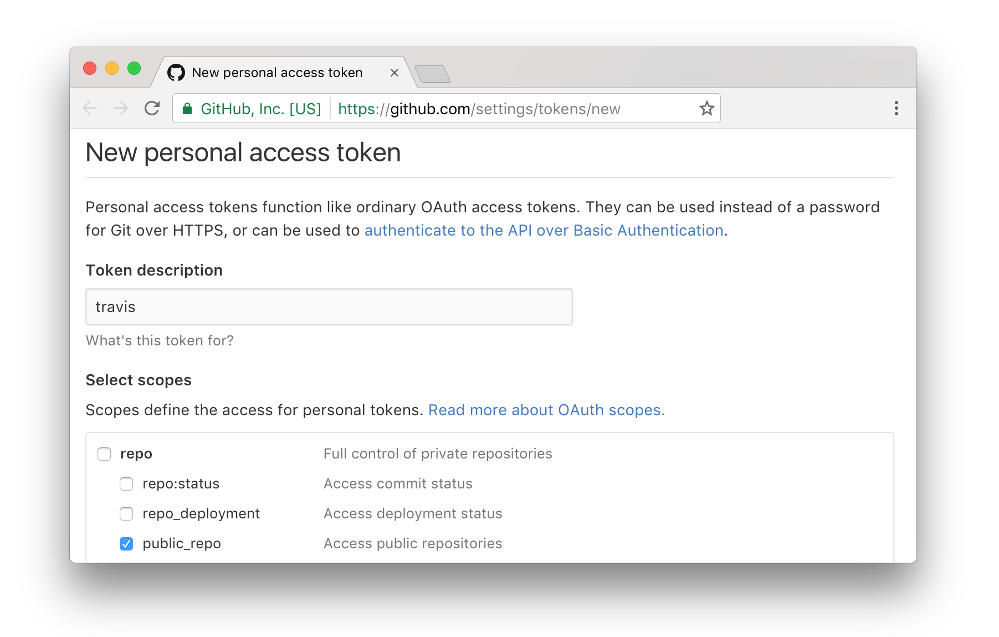

```{r global_options, include=FALSE}
# R output pre blocks are styled by default to indicate output
knitr::opts_chunk$set(comment = NA, eval = FALSE)

# shorthand for rd_link() - see ?packagedocs::rd_link for more information
rdl <- function(x) packagedocs::rd_link(deparse(substitute(x)))
```

# packagedocs

packagedocs provides a mechanism for simple generation and automated deployment nice-looking online R package documentation that plugs into the traditional R package vignette system.

# Features

Some features of this package include:

- All documentation is generated from a single file, `"vignettes/docs.Rmd"`
- Documentation is nicely styled and responsive for mobile viewing with a collapsible auto-scrolling table of contents
- Simple Github / TravisCI hooks for automatically building and deploying documentation to your github pages branch after each commit
- Github pages branch is stomped on each commit to prevent repository bloat
- Once configured, any commits pushed to the master branch of repository https://github.com/username/reponame will have docs made automatically available at https://username.github.io/reponame
- Valid R vignettes are generated that point to the live version of the rendered docs
- Support for [lazy rendering](https://github.com/hafen/lazyrmd) of htmlwidget outputs, useful when embedding several visualizations in a vignette
- Automatic generation of all R object and function documentation, called the "function reference"
- Examples in the function reference are evaluated and the output, including graphics is included inline with the documentation
- The function reference can be organized into groups with custom headings using a yaml configuration file
- A convenience function is provided for linking references to functions in your vignette directly to the associated function documentation on the generated function reference page
- Helper functions to initialize, run, and set up your docs for Github deployment

# Quick Start

It is pretty straightforward to add packagedocs documentation to a package.

## Initializing Vignettes

Given an R package directory with documented functions, you can initialize your vignettes from within the package's directory with:

```r
# in current package directory
packagedocs::init_vignettes()
```

This will create three files in your package's `"vignettes"` directory: `"docs.Rmd"`, `"rd.Rmd"`, and `"rd_index.yaml"`.  You can read more about the latter two files in the "Function Reference Customization" section below, but the main file of interest is `"vignettes/docs.Rmd"`.

## Building Vignettes

The `docs.Rmd` file is the home webpage for your package's documentation. The main content has very little structure, allowing you to insert any `rmarkdown` formatted document. (Just like this one!).  The `docs.Rmd` file is a great place to show off long examples that regular function documentation just cannot do justice.

```r
packagedocs::build_vignettes()
```

This manually builds vignettes and places them by default in a directory `"_gh-pages`.  You can view the pages in this directory to see what your rendered documentation looks like.  This function also generates vignette files placed in `"inst/docs"` that redirect to the location where you will host the pages.

You can push the contents of this directory to a custom website location where you would like to host your documentation.  A much more convenient option, however, is to configure your packagedocs to be delpoyed automatically by the TravisCI build every time you make a package commit to Github.

## TravisCI Deployment

To initialize automatic documentation builds from TravisCI, you need to do the following:

1. Get a github API key and make it available as an environment variable `GITHUB_PAT`.  This can be done by visiting [https://github.com/settings/tokens](Github > Settings > Tokens).  The minimal scope to select is "public_repo".
    
2. Install the TravisCI Ruby Gem (and Ruby if it isn't installed).  On most MacOS and Linux systems, Ruby is already installed.  On Windows, a good option for Ruby is [RubyInstaller](http://rubyinstaller.org/).  Once you have Ruby, you need to install the travis Ruby gem:
    ```bash
    gem install travis
    ```
There appears to be an R package that will make this process easier in the future.
3. Make sure your repository is activated in TravisCI by visiting [https://travis-ci.org/profile](https://travis-ci.org/profile).
4. Run:
    ```r
    packagedocs::use_travis()
    ```
This will set things appropriately in your `.travis.yml` file such that future commits will build the documentation and push it to the gh-pages branch of your repository.

<!-- Please visit [https://docs.travis-ci.com/user/encryption-keys/](https://docs.travis-ci.com/user/encryption-keys/) for full documentation provided by Travis. -->

Note that if you go the `use_travis()` route, you never need to run `packagedocs::build_vignettes()` locally other than as a method to check the vignette output prior to deploying, and once to generate the vignette redirects.

You are now all set up.

# Function Reference Customization

When you initialize your packagedocs vignettes, files are generated that provide a default rendering of the function reference, which is a listing of all documented functions in the package. The following files are created:

- `rd.Rmd`
    + This file is a shell file that will be filled with compiled `rd_index.yaml` information.  The compiled `rd_index.yaml` information will be appended to the `rmarkdown` document.
    + It is okay to not touch this file at all, but if you'd like you can add some header content to this document.
- `rd_index.yaml`
    + The `rd_index.yaml` is a yaml file that contains the layout for the `rd.Rmd` file.
    + There are two main sections: `knitr` and `sections`.
        * `knitr`
            * Is a list of [knitr chunk options](http://yihui.name/knitr/options/)
            * These options are the default options for all topics. They may be overwritten in each topic for different behavior
        * `sections`
            * It contains a list of `section` and `topics` pairs.  Editing the topics field is discussed in more detail below.
            * The section pairs in the `rd_index.yaml` file are auto-generated according to the keywords used in the package documentation.  All functions that do not have a keyword will be placed in the last section.  `internal` keyword functions will not be added automatically.
            * It is okay to rename, remove, rearrange, or repeat the sections and topics!

## Editing rd_index.yaml

This file will be auto-generated from `r rdl(packagedocs::init_vignettes())`.  It will contain a list of `section_name` and `topics` pairs.  The `topics` field is a list of items that can either be a character string or an object.

A topic may be a single character string.  This will be upgraded at run time.  The following example will produce the same topic:

```{cat}
- my_function
-
  title: my_function
  file: my_function.Rd
```

The following `topic` object fields will be understood by packagedocs:

* `title`
    * The `title` field is the string of text that will be displayed in the table of contents and at the top of the documentation for the specific topic.
    * The default value is equivalent to `gsub("\\.Rd", "", file)`
    * At least one of the `title` or `file` fields must be provided
* `file`
    * The `file` field corresponds to the name of the R documentation file that will be displayed.  These files can be found in your `man` folder.
    * The default value is equivalent to `paste0(title, ".Rd")`.
    * At least one of the `title` or `file` fields must be provided
* `knitr`
    * If you would like to override example knitr behavior for a given topic, set this field to a list of [knitr chunk options](http://yihui.name/knitr/options/).
    * This field is optional

The topics below will all produce the same information:

```{cat}
- my_function
-
  title: my_function
-
  file: my_function.Rd
-
  title: my_function
  file: my_function.Rd
```

# Opinionated

There are a few opinions baked into this package:

First, with this package your vignette is a single R Markdown document.  If you like the idea of multiple vignettes, think of each individual vignette as a section in this master R markdown document.  Personally, when packages have multiple vignettes, I find it difficult to know which ones are relevant and in what order I should look at them.  With a single master vignette, there is a better complete narrative but still the ability to break things into natural sections.

Second, I am a huge proponent of only storing minimal code that is needed to support a package on github.  Repositories quickly become bloated when generating and re-generating binary or difficult-to-diff files like raster images or large htmlwidget blobs.  Because of this, the mode of operation for this package is for you to check in your vignette sources (`'vignettes/docs.Rmd'`), but the resulting generated pages are deployed in a separate branch, `gh-pages`,
 (use gh-pages).  Most vignettes (hopefully) contain several visualizations

Compiling all of the necessary components into two self contained vignettes makes the package too large to submit to CRAN without issues.  Therefore, `packagedocs` takes the approach of creating html vignettes that are submitted to CRAN that automatically redirect to the gh-pages of the github repository of the R package.  This allows for documentation that directly matches the latest master branch while not over inflating the package that is submitted to CRAN.  Please read the section on Deploying to Travis below for further information.

# Additional Notes

## Vignettes

`packagedocs` creates two forms of vignettes: html redirect vignettes that are submitted to CRAN and full html vignettes that are placed in the gh-pages of your github repo.  I will refer to them as 'CRAN vignettes' and 'gh-pages vignettes' respectively

### Vignette Engines

There only one packagedocs vignette engine: `packagedocs::redirect`.  This engine requires an `.Rmd` file with the key `redirect` in the yaml header of the `.Rmd` file.  It will produce an html vignette that automatically redirects to the website provided.


### Mixing Vignette Engines

Package docs may be built along side other vignette engines, such as `knitr`. `knitr` will be used as an example in the section.

To include other vignette engines, set your `VignetteBuilder` line in the `DESCRIPTION` file to be `VignetteBuilder: packagedocs,knitr`.  When the regular vignette build process occurs, the non-`packagedocs` vignettes will be built like normal, and the `packagedocs` vignettes will produce html redirects to the gh-pages vignettes on github.  `r rdl(packagedocs::build_vignettes())` and `r rdl(packagedocs::deploy_travis())` will generate all vignette files (even non-`packagedocs` vignettes).  Feel free to add your other vignettes to the `navpills` header field of `docs.Rmd` and `rd.Rmd` vignettes for in between vignette navigation.

## Package Size Constraint

Compiling all of the necessary components into two self contained vignettes makes the package too large to submit to CRAN without issues.  Therefore, `packagedocs` takes the approach of creating html vignettes that are submitted to CRAN that automatically redirect to the gh-pages of the github repository of the R package.  This allows for documentation that directly matches the latest master branch while not over inflating the package that is submitted to CRAN.  Please read the section on Deploying to Travis below for further information.

## Deploy after success

**!!! Using this function will STOMP the gh-pages every time `r rdl(packagedocs::deploy_travis())` is called.  Use this function wisely! !!!**

By default, if it is the master branch and it is not a pull request, `r rdl(packagedocs::deploy_travis())` will build both the CRAN vignettes and gh-pages vignettes.  `r rdl(deploy_travis())` will then deploy the generated `_gh-pages` folder (default) from Travis to the package's github repo. This forced commit will be done by "Travis CI" user (default).

Please look at `r rdl(deploy_travis)` for more information.

## Dev notes

The template style is based on bootstrap with several customizations.  These are built using less and gulp with node.js.  These are not necessary for using the package, but for development, you can do `bower install` after checking out the repo to get a dev environment going.

# Future work

- Themes
- New RMarkdown developments

# Acknowledgements

This package has gone through several iterations, and was heavily influenced and borrows from Hadley Wickham's staticdocs (now [pkgdown](https://github.com/hadley/pkgdown)) package.
